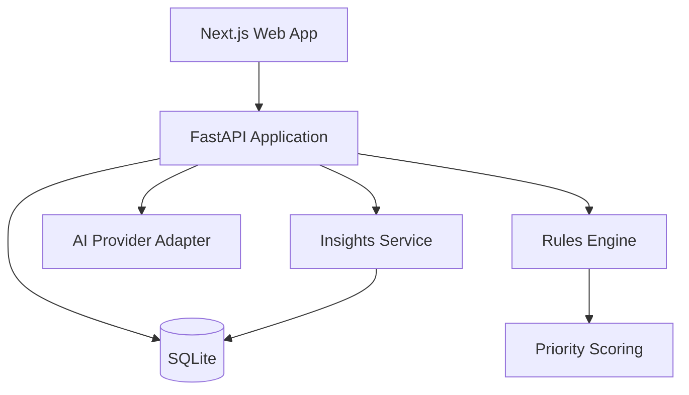

# Architecture

## Architecture goal

Build the smallest architecture that cleanly separates:

- source data;
- deterministic validation;
- prioritization;
- human workflow;
- AI assistance;
- outcome/analytics.

The portfolio version is a modular monolith, not a distributed system.



## Backend modules

```text
app/
  api/
  domain/
  rules/
  scoring/
  services/
    batch_service.py
    review_service.py
    insight_service.py
    ai_service.py
  repositories/
  db/
```

## Frontend routes

```text
/                         Operations Control Center
/exceptions               Review Queue
/exceptions/[id]          Exception Detail
/insights                 Operations Insights
/improvements             Improvement Opportunities
/improvements/[id]        Opportunity Detail
```

## Core entities

- Batch
- EmployeeRecord
- Exception
- RuleResult
- PriorityBreakdown
- ReviewResolution
- AuditEvent
- ImprovementOpportunity
- AIInvestigation

See [`packages/domain/SCHEMA.md`](packages/domain/SCHEMA.md).

## Important boundary

`Rules Engine -> Exception` is deterministic.

`AI Provider -> AIInvestigation` is advisory.

The AI service has no repository method that can resolve or mutate an exception. Enforce the boundary structurally, not only through prompts.

## Data strategy

Use SQLite until the demo needs concurrent users or deployment constraints justify PostgreSQL.

Store:

- raw synthetic record;
- normalized fields;
- triggered rule results;
- priority contributions;
- human resolution;
- timestamps;
- AI output + model metadata;
- audit events.

## Deployment target

For a portfolio demo:

- web + API in Docker Compose locally;
- optionally deploy web/API as a single small service or two simple services;
- SQLite can remain local for demo environments.

Do not add infrastructure purely to make the architecture diagram larger.
