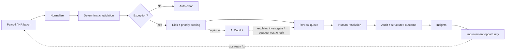

# Payroll Ops Workbench

A focused **Operations Excellence prototype** for high-volume payroll operations.

The core idea is simple:

> **Do not automate judgment. Automate the path that decides what deserves human attention.**

A payroll team should not manually inspect 1,000 records if 930 are clean. The system should automatically clear deterministic, low-risk cases; surface the exceptions that matter; explain why they were surfaced; capture the operator's resolution; and turn recurring exceptions into process-improvement opportunities.

This repository is intentionally an **implementation scaffold**, not a finished application. It is designed to be handed to a coding agent or used as the starting point for a small, polished portfolio project.

> **Important:** all data and rules in this repository are synthetic. The project does not calculate statutory payroll, taxes, contributions, legal entitlements, or compliance decisions.

---

## Product thesis

High-volume operational teams usually suffer from two different problems:

1. too much repetitive review work;
2. the same exceptions recurring because nobody turns queue data into upstream process fixes.

Payroll Ops Workbench attacks both.



The important loop is not `AI -> payroll`. It is:

**observe -> prioritize -> resolve -> learn -> eliminate recurring friction.**

---

## What the final demo should contain

### 1. Operations Control Center
A compact home screen showing:

- records processed;
- auto-clear rate;
- cases requiring review;
- critical exceptions;
- estimated manual effort avoided;
- exception trend;
- top recurring causes.

### 2. Exception Queue
A dense, useful operational table with:

- priority;
- employee / record identifier;
- issue;
- risk score;
- financial exposure;
- age / SLA;
- assignee;
- AI explanation availability.

The queue is the heart of the product.

### 3. Exception Detail
The operator sees:

- current value vs expected / historical context;
- deterministic rules triggered;
- interpretable priority breakdown;
- related HR events;
- AI-generated explanation and suggested checks;
- resolution actions;
- audit history.

### 4. Resolution Workflow
Only a human can resolve a case:

- Confirm issue
- Mark as expected
- Request information
- Escalate

Every resolution requires a structured reason code.

### 5. Operations Insights
Aggregate resolved cases to answer:

- What creates the most manual work?
- Which exception types are increasing?
- Which rules are noisy?
- Which teams/processes generate recurring friction?
- Where would an upstream process change save the most time?

### 6. Improvement Opportunities
Turn recurring patterns into actionable mini business cases:

- problem;
- root-cause hypothesis;
- monthly occurrences;
- handling time;
- estimated effort wasted;
- suggested intervention;
- implementation effort;
- expected ROI;
- KPI to monitor after release.

---

## Deliberate AI boundary

AI is useful only where ambiguity exists.

It may:

- explain why a case is unusual in plain language;
- summarize relevant evidence;
- identify related events in provided context;
- suggest what an operator should verify next;
- draft an improvement proposal from structured aggregate data.

It may **not**:

- approve payroll;
- auto-resolve a case;
- mutate source records;
- override deterministic controls;
- invent missing evidence;
- present legal/payroll advice as fact.

See [`docs/AI_GUARDRAILS.md`](docs/AI_GUARDRAILS.md).

---

## Proposed stack

Keep the implementation deliberately boring.

| Layer | Choice | Why |
|---|---|---|
| Web | Next.js + TypeScript | Fast product iteration, excellent table/detail UX |
| API | FastAPI + Python | Natural home for rules, scoring and data processing |
| Persistence | SQLite for demo | Zero operational overhead |
| Styling | CSS variables + Tailwind or CSS modules | Easy implementation of the design system |
| AI | Provider adapter behind one interface | Swap models; keep domain logic independent |
| Local runtime | Docker Compose | One command demo without infrastructure theatre |

Do **not** introduce microservices, Kafka, Kubernetes, a vector database, or a workflow engine unless a concrete requirement appears.

---

## Repository map

```text
.
├── README.md
├── DESIGN.md                 # Jet HR-inspired visual system
├── AGENTS.md                 # coding-agent implementation brief
├── ARCHITECTURE.md
├── PRODUCT.md
├── IMPLEMENTATION_PLAN.md
├── .env.example
├── .gitignore
├── apps/
│   ├── web/
│   │   ├── README.md
│   │   └── src/styles/tokens.css
│   └── api/
│       └── README.md
├── packages/domain/
│   └── SCHEMA.md
├── data/
│   ├── sample_payroll_batch.csv
│   └── DATA_DICTIONARY.md
├── docs/
│   ├── USER_FLOWS.md
│   ├── AI_GUARDRAILS.md
│   ├── METRICS.md
│   ├── DECISIONS.md
│   └── DEMO_SCRIPT.md
└── .github/workflows/
    └── README.md
```

---

## Suggested demo story

Do not demo the app feature-by-feature. Demo one operational story.

1. A batch of 1,284 payroll records lands.
2. 1,191 are auto-cleared by deterministic checks.
3. 93 enter the review queue.
4. The operator opens a critical salary-change anomaly.
5. The app explains *why* it is critical and shows evidence.
6. AI suggests checking for a missing salary-change event, but does not decide.
7. The operator marks the case as expected with a structured reason.
8. Insights show that missing upstream data creates 37% of monthly review effort.
9. The app proposes an onboarding validation as a low-effort/high-impact process fix.

The product story is therefore not **"AI finds payroll errors."**

It is **"structured operations data tells us where human attention is needed and where the process itself should change."**

---

## Design

The visual direction is documented in [`DESIGN.md`](DESIGN.md). It is **inspired by Jet HR's public product/brand language**, but it does not include or redistribute Jet HR proprietary assets and is not presented as an official Jet HR interface.

---

## Status

**Scaffold / pre-implementation.**

Recommended first implementation milestone: a fully polished static UI with seeded data before writing the backend. The portfolio value comes from showing product judgment and operational clarity, not infrastructure complexity.
