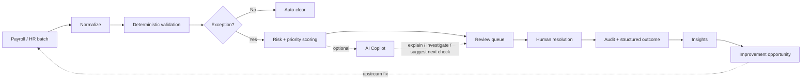

# Payroll Ops Workbench

A focused **Operations Excellence** prototype for high-volume payroll operations.

> **Do not automate judgment. Automate the path that decides what deserves human attention.**

A payroll team should not inspect 1,000 records if 930 are clean. The workbench automatically clears deterministic low-risk cases, surfaces the exceptions that matter, explains why they were queued, captures the operator's resolution, and turns recurring exceptions into upstream process fixes.

**All data and rules are synthetic.** This project does not calculate statutory payroll, taxes, contributions, legal entitlements, or compliance decisions.

---

## Product thesis

High-volume operational teams usually suffer from two different problems:

1. too much repetitive review work;
2. the same exceptions recurring because nobody turns queue data into upstream process fixes.



The important loop is not `AI -> payroll`. It is:

**observe -> prioritize -> resolve -> learn -> eliminate recurring friction.**

---

## Run the demo

```bash
# API
cd apps/api
python3 -m pip install -r requirements.txt
python3 -m uvicorn app.main:app --reload --port 8000

# Web
cd apps/web
npm install
npm run dev
```

Open [http://localhost:3000](http://localhost:3000).

One-command alternative:

```bash
docker compose up --build
```

The first API boot seeds a synthetic September 2026 batch: **1,284 records**, **1,191 auto-cleared**, **93 in review**.

### Tests

```bash
cd apps/api && python3 -m pytest -q
cd apps/web && npm run typecheck
```

---

## What to click in 90 seconds

1. **Operations Control Center** — most of the batch is auto-cleared; 93 cases still need a person.
2. **Review queue** — sort/filter to critical and open `EMP-1042`.
3. **Exception detail** — salary moved +42% with no HR event; the score breakdown is deterministic.
4. Optional: **Ask for investigation**. AI summarizes evidence and cannot resolve the case.
5. **Mark as expected** with reason `Salary increase`.
6. **Insights** — missing bank information is the largest source of avoidable effort.
7. Open the **improvement opportunity** and read the upstream onboarding fix.

---

## Why AI is not autonomous here

AI may explain triggered checks, summarize provided evidence, suggest the next verification, and draft improvement prose.

AI may **not** approve payroll, resolve a case, edit source records, override deterministic rules, or invent missing evidence.

The AI service has no method that can change exception state. The product remains useful with `AI_PROVIDER=disabled`.

See [`docs/AI_GUARDRAILS.md`](docs/AI_GUARDRAILS.md).

---

## Architecture

Modular monolith. No microservices, no vector database, no workflow engine.

| Layer | Choice |
|---|---|
| Web | Next.js + TypeScript |
| API | FastAPI + Python |
| Persistence | SQLite |
| AI | Provider adapter (`mock` by default) |

```text
apps/web     Operations Control Center, queue, detail, insights, improvements
apps/api     import → rules → scoring → resolution → insights
```

---

## Design

Light, high-trust UI with a Jet HR-inspired lime accent. Tables stay dense. The AI panel is secondary to evidence.

See [`DESIGN.md`](DESIGN.md). This is an independent portfolio prototype and is not an official Jet HR product.

---

## Screenshots

The UI is designed at 1440×900. Images below are captured from the running seeded demo.


---

## Status

**Working MVP.** Deterministic detection, human resolution, insights, and improvement opportunities are implemented against a seeded synthetic dataset.
