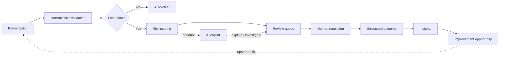

# Payroll Ops Workbench

**An operations workbench that turns high-volume payroll data into a prioritized review queue — and recurring exceptions into upstream process fixes.**

Built as a portfolio project for an **Operations Excellence / product-builder** role. It demonstrates how to design operational software where deterministic rules do the routing, humans own the decisions, and aggregate outcomes drive process improvement.

> **Do not automate judgment. Automate the path that decides what deserves human attention.**

All data and rules are **synthetic**. This project does not calculate statutory payroll, taxes, contributions, or legal entitlements.

---

## Demo

<video src="docs/demo/payroll_ops_workbench_demo.mp4" controls width="100%"></video>

**90-second walkthrough:** a batch of 1,284 records lands → 1,191 auto-cleared → 93 enter review → operator investigates a critical salary anomaly → resolves with a structured reason → insights reveal where manual effort is wasted → the app proposes an upstream fix.

| Step | Screen | What to notice |
|---|---|---|
| 1 | Operations Control Center | 93% auto-clear rate; only exceptions need a human |
| 2 | Review queue | Cases ranked by interpretable priority, not gut feel |
| 3 | Exception detail (`EMP-1042`) | +42% salary change with no HR event; score breakdown is explicit |
| 4 | AI investigation | Summarizes evidence and suggests checks — cannot resolve |
| 5 | Resolution | Operator marks as expected with a structured reason code |
| 6 | Insights | Missing IBAN accounts for 31% of manual review effort |
| 7 | Improvement opportunity | Upstream onboarding validation with estimated ROI |

---

## The problem

Payroll operations teams reviewing large batches face two compounding issues:

1. **Too much repetitive review** — operators inspect clean records because the system cannot distinguish safe cases from real exceptions.
2. **The same exceptions keep coming back** — queue data is never turned into upstream process fixes.

The cost of missing a real exception is high, so teams default to reviewing everything. That creates noise, burnout, and no learning loop.

## What the app does

Payroll Ops Workbench is an internal tool for **Payroll / Operations Specialists** and **Operations Leads**. It implements one operational loop:



**observe → prioritize → resolve → learn → eliminate recurring friction**

### For the operator

- See only cases that deserve attention
- Understand exactly why a case is in the queue and how critical it is
- Get enough context to resolve quickly
- Record every decision with a traceable, structured reason

### For the operations lead

- See where the team spends manual effort
- Identify noisy rules and recurring root causes
- Quantify the impact of fixing them upstream
- Turn patterns into actionable improvement proposals

---

## Screens

### Operations Control Center

Batch health at a glance: records processed, auto-clear rate, review backlog, critical count, and top recurring causes.


### Review queue

Dense, filterable table — priority, employee, issue type, risk score, financial exposure, age, and assignee. The queue is the heart of the product.


### Exception detail

Current vs expected values, triggered rules, interpretable score breakdown, related HR events, optional AI investigation, and resolution actions.


### Insights

Aggregated operational analysis derived from real resolutions — not invented AI commentary. Shows where manual effort concentrates and which improvements matter most.


### Improvement opportunity

Recurring patterns become mini business cases: root-cause hypothesis, monthly frequency, handling time, estimated effort wasted, suggested intervention, and expected ROI.


---

## Product decisions

These constraints shaped every implementation choice:

| Principle | How it shows up |
|---|---|
| **Deterministic before probabilistic** | Rules detect and route; AI never overrides them |
| **Human accountability at the boundary** | Only an operator can resolve a case |
| **Explain every score** | Every risk score exposes its component breakdown |
| **Structured feedback** | Every resolution requires a reason code |
| **Measure work removed** | Insights and improvements are derived from operational data |
| **AI is advisory** | Useful with AI disabled; no method can mutate case state |

See [`docs/AI_GUARDRAILS.md`](docs/AI_GUARDRAILS.md) for the full AI boundary.

---

## Tech stack

Deliberately boring — a modular monolith, no infrastructure theatre.

| Layer | Choice | Role |
|---|---|---|
| Web | Next.js + TypeScript | Control center, queue, detail, insights, improvements |
| API | FastAPI + Python | Import, rules, scoring, resolution, insights |
| Persistence | SQLite | Zero-overhead demo persistence |
| AI | Provider adapter (`mock` default) | Investigation summaries; swappable provider |
| Styling | Tailwind + CSS tokens | Light, high-trust UI with lime accent |

```text
apps/web     UI — tables, detail views, resolution drawer, AI panel
apps/api     Domain engine — rules → scoring → persistence → insights
```

---

## Run locally

**Prerequisites:** Python 3.11+, Node 20+

```bash
# Terminal 1 — API
cd apps/api
python3 -m pip install -r requirements.txt
python3 -m uvicorn app.main:app --reload --port 8000

# Terminal 2 — Web
cd apps/web
npm install
npm run dev
```

Open [http://localhost:3000](http://localhost:3000).

The first API boot seeds a synthetic September 2026 batch: **1,284 records**, **1,191 auto-cleared**, **93 in review**.

**Docker alternative:**

```bash
docker compose up --build
```

**Tests:**

```bash
cd apps/api && python3 -m pytest -q
cd apps/web && npm run typecheck
```

---

## Documentation

| Document | Contents |
|---|---|
| [`PRODUCT.md`](PRODUCT.md) | Problem, users, jobs to be done, MVP scope |
| [`DESIGN.md`](DESIGN.md) | Visual system and UI principles |
| [`ARCHITECTURE.md`](ARCHITECTURE.md) | System design and module boundaries |
| [`docs/DEMO_SCRIPT.md`](docs/DEMO_SCRIPT.md) | Narration script for the 90-second demo |
| [`docs/AI_GUARDRAILS.md`](docs/AI_GUARDRAILS.md) | What AI may and may not do |
| [`docs/USER_FLOWS.md`](docs/USER_FLOWS.md) | End-to-end user journeys |

---

## Status

**Working MVP** — deterministic detection, interpretable scoring, human resolution workflow, operational insights, and improvement opportunities, all running against a seeded synthetic dataset.
