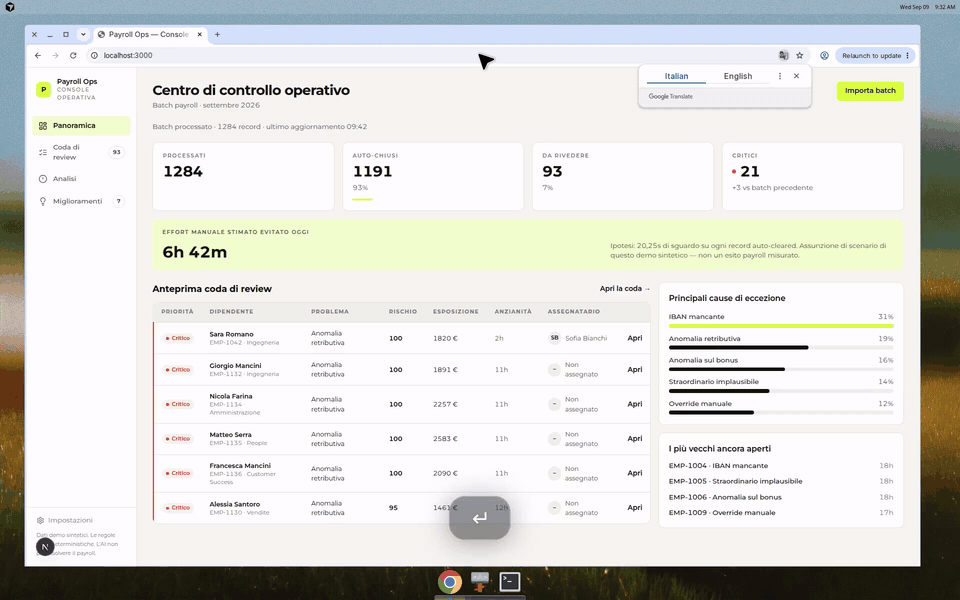
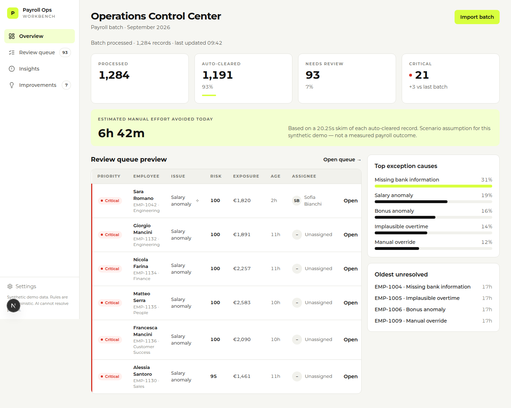
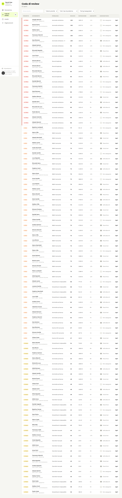
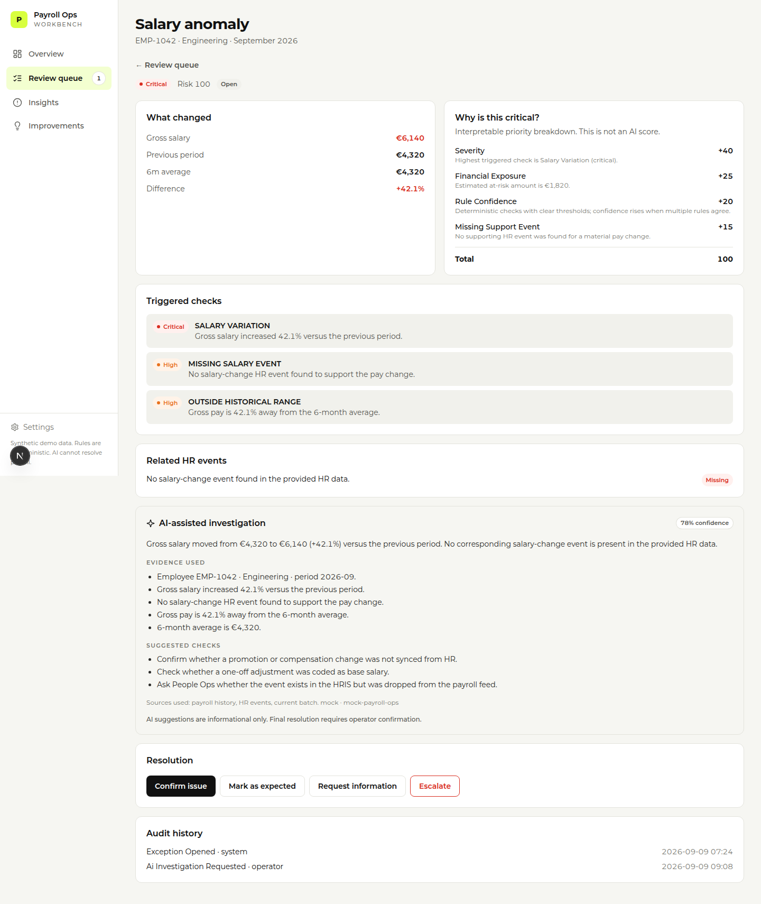
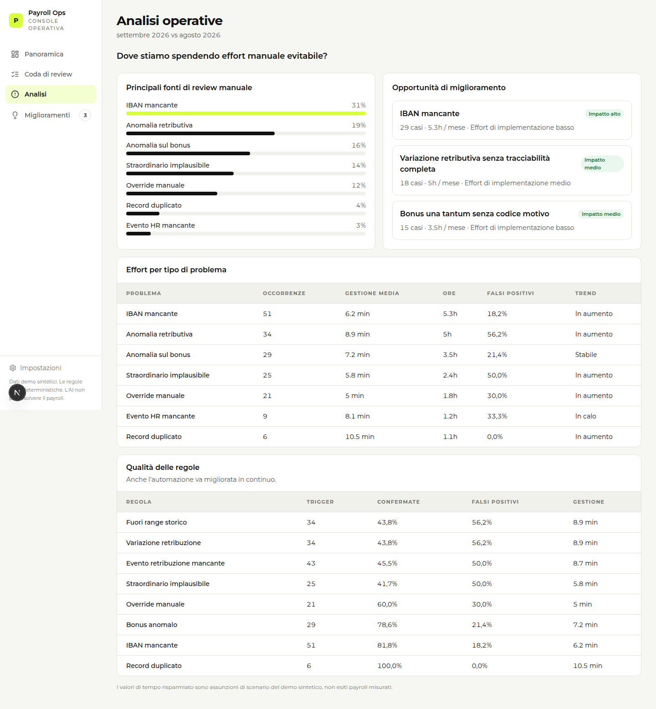
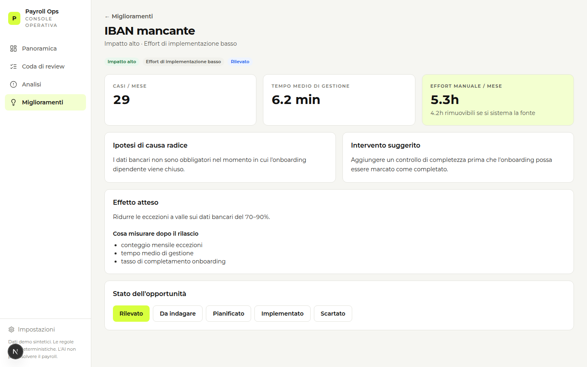

# Payroll Ops Workbench

**Non far rivedere 1.284 cedolini. Far rivedere i 93 che possono fare danno — e usare quelli per chiudere il buco a monte.**

Console operativa per specialisti payroll: regole deterministiche che auto-chiudono i record sicuri, coda di review ordinata da uno score spiegabile, risoluzione umana strutturata, insights che misurano l’effort sprecato. L’AI può investigare. Non può chiudere un caso.

Costruito come showcase per **Operations Excellence @ Jet HR**. Non è un prodotto ufficiale Jet, non calcola contributi/TFR/imposte, i dati sono sintetici. È la mia risposta alla domanda del ruolo: *cosa sta rallentando un team payroll, e quale strumento — della misura giusta — lo elimina.*

*In English: an internal ops workbench that auto-clears safe payroll records, queues the rest with an interpretable score, and turns recurring exceptions into upstream process fixes.*

---

## Demo — 57 secondi

<p align="center">
  <a href="docs/demo/payroll_ops_workbench_demo.mp4">
    
  </a>
</p>

<p align="center">
  <strong><a href="docs/demo/payroll_ops_workbench_demo.mp4">▶ Apri il video in player nativo (57s, MP4)</a></strong><br/>
  <sub>Il GIF è il walkthrough. Il click apre l’MP4 nel player di GitHub.</sub>
</p>

Batch di settembre 2026 → 1.284 record → **1.191 auto-chiusi (93%)** → **93 in review** → Sara Romano, `EMP-1042`, retribuzione **+42,1%** senza evento HR → lo score 100 è una somma, non un oracolo → l’AI riassume le evidenze e si ferma → l’operatore chiude con un reason code → Insights: l’IBAN mancante vale **5,3 ore/mese** → proposta: blocco di completezza in onboarding.

| Tempo | Cosa vedi | Cosa deve restare in testa |
|---|---|---|
| 0–15s | Centro di controllo | Il 93% non merita uno sguardo umano. Oggi sono **6h 42m** di sguardo evitati. |
| 15–25s | Coda di review | 93 casi, i critici in cima, esposizione in euro, non un'inbox. |
| 25–45s | `EMP-1042` | +42,1% vs periodo precedente. Tre regole scattate. Lo score è scomponibile. |
| 45–57s | IBAN mancante | 31% delle eccezioni, 5,3h di gestione. Fix a monte: −70–90% a valle. |

Script di narrazione: [`docs/DEMO_SCRIPT.md`](docs/DEMO_SCRIPT.md).

---

## Il problema che ho scelto

Un team payroll che rivede un batch intero non è “accurato”. È un team che non si fida del routing, perché il costo di un errore vero è alto e il sistema non sa distinguere un record pulito da uno pericoloso.

Due effetti, sempre gli stessi:

1. **Rumore.** Si spendono minuti su record che una regola esplicita avrebbe potuto chiudere.
2. **Niente apprendimento.** L’IBAN manca anche il mese dopo, perché l’esito della review resta un commento libero e non torna nel processo.

L’ambizione non è una coda più intelligente per sempre. È **farla rimpicciolire**.

---

## Il loop

```text
batch  →  regole deterministiche  →  auto-clear | review
                                          ↓
                                    score spiegabile
                                          ↓
                                    operatore decide
                                          ↓
                                    reason code
                                          ↓
                                    insights  →  miglioramento a monte
```

`osserva → priorizza → risolvi → impara → togli la causa`

L’AI è un binario laterale: legge evidenze già in pagina, propone controlli, **non muta lo stato del caso**. Se il provider è spento, il prodotto resta usabile.

### Per l’operatore

- Vede solo ciò che ha fallito un controllo.
- Sa *perché* è in coda e *quanto* è critico, componente per componente.
- Chiude in quattro esiti: conferma, atteso, richiesta info, escalation — con un motivo obbligatorio.

### Per chi guida le operations

- Vede dove si concentra l’effort evitabile.
- Distingue una regola rumorosa da un buco di processo.
- Trasforma un pattern ricorrente in un mini-business case: frequenza, minuti, ore, intervento, KPI post-rilascio.

---

## Il caso che spiega il prodotto

**Sara Romano · `EMP-1042` · Ingegneria · settembre 2026**

| Evidenza | Valore |
|---|---|
| Lordo attuale | €6.140 |
| Periodo precedente / media 6 mesi | €4.320 |
| Variazione | **+42,1%** |
| Evento HR di cambio retribuzione | **mancante** |
| Score | 100 — *non è uno score AI* |

Come si compone (deterministico):

| Componente | Punti | Perché |
|---|---:|---|
| Gravità | +40 | `SALARY_VARIATION` ≥ 40% → critical |
| Esposizione finanziaria | +25 | delta lordo a rischio |
| Affidabilità della regola | +20 | soglie esplicite, più regole concordano |
| Evento di supporto mancante | +15 | variazione rilevante senza evento HR |
| **Totale** | **100** | visibile in pagina, testato in pytest |

L’AI, se chiamata, dice la stessa cosa in prosa e suggerisce tre verifiche (promozione non allineata, una tantum registrata come base, evento HRIS non arrivato in payroll). In fondo al pannello: *i suggerimenti sono informativi; la risoluzione la fa l’operatore*.

Questo è il confine che mi interessa: **l’automazione decide il percorso, l’umano decide il merito.**

---

## Decisioni di prodotto

Quelle che chi valuta la candidatura dovrebbe poter inferire senza che gliele spieghi.

| Principio | Come si vede nel codice e in UI |
|---|---|
| Deterministico prima del probabilistico | 8 regole in `apps/api/app/rules`. L’AI non le può spegnere. |
| Accountability sulla risoluzione | Solo `POST /exceptions/{id}/resolve`. Investigate non scrive lo stato. |
| Ogni score è una somma | `severity + exposure + confidence + missing_event`. Niente black box. |
| Feedback strutturato | Reason code obbligatorio: senza quello Insights non impara. |
| Misurare lavoro tolto, non feature spedite | Banner 6h 42m con ipotesi visibile (20,25s/record). IBAN: 5,3h/mese, di cui 4,2h eliminabili. |
| AI advisory | Adapter `mock` di default. Guardrail in [`docs/AI_GUARDRAILS.md`](docs/AI_GUARDRAILS.md). |
| Soluzione della misura giusta | Monolite modulare, SQLite, niente microservizi, niente vector DB. |

---

## Schermate

### Centro di controllo operativo

1.284 processati · 1.191 auto-chiusi · 93 da rivedere · 21 critici. Il lime è per l’azione e per l’effort evitato, non per fingere che il rischio sia “ok”.



### Coda di review

Tabella densa: priorità, dipendente, problema, rischio, esposizione, età, assegnatario. È il cuore del prodotto — deve stare veloce a 100+ righe.



### Dettaglio eccezione

Cosa è cambiato, perché è critico, controlli scattati, eventi HR, investigation AI, quattro azioni di chiusura, audit trail.



### Analisi operative

Domanda della pagina: *dove stiamo spendendo effort manuale evitabile?* IBAN mancante 31%. Qualità delle regole in tabella: trigger, confermati, falsi positivi, tempo di gestione.



### Opportunità di miglioramento

L’IBAN non è “un ticket da fare ogni mese”. È un campo opzionale in chiusura onboarding. Intervento: completezza obbligatoria. Effetto atteso: −70–90% delle eccezioni a valle. Stato tracciato: rilevato → indagare → pianificato → implementato.



---

## Stack

Volutamente noioso. Il valore sta nel routing, non nell’infrastruttura.

| Layer | Scelta | Perché |
|---|---|---|
| Web | Next.js + TypeScript | Coda, dettaglio, insights. UI in italiano, lime Jet-inspired. |
| API | FastAPI + Python | Import, regole, scoring, risoluzione, insights. |
| DB | SQLite | Zero overhead per una demo che deve bootare al primo `uvicorn`. |
| AI | Adapter (`mock` default) | Swappabile. Se manca, il resto del prodotto non si accorge. |

```text
apps/web     UI — tabelle, drawer di risoluzione, pannello AI secondario
apps/api     Motore — rules → scoring → persistenza → insights
```

Testati in particolare: auto-clear dei record puliti, caso hero `EMP-1042`, invarianza dello score, confine AI (investigate ≠ resolve).

---

## Avvio locale

Python 3.11+ · Node 20+.

```bash
# Terminale 1 — API (al primo boot seeda il batch sintetico)
cd apps/api
python3 -m pip install -r requirements.txt
python3 -m uvicorn app.main:app --reload --port 8000

# Terminale 2 — Web
cd apps/web
npm install
npm run dev
```

Apri [http://localhost:3000](http://localhost:3000).

```bash
docker compose up --build              # alternativa
cd apps/api && python3 -m pytest -q     # regole, scoring, confine AI
cd apps/web && npm run typecheck
```

---

## Documenti

| File | Contenuto |
|---|---|
| [`PRODUCT.md`](PRODUCT.md) | Problema, utenti, jobs to be done, non-goal |
| [`DESIGN.md`](DESIGN.md) | Sistema visivo: lime, densità, AI secondaria |
| [`ARCHITECTURE.md`](ARCHITECTURE.md) | Confini del monolite |
| [`docs/AI_GUARDRAILS.md`](docs/AI_GUARDRAILS.md) | Cosa l’AI può e non può fare |
| [`docs/USER_FLOWS.md`](docs/USER_FLOWS.md) | Review critica, friction ricorrente, AI spenta |
| [`docs/DEMO_SCRIPT.md`](docs/DEMO_SCRIPT.md) | Voce del video |

---

## Cosa questo progetto non è

- Non è un motore paghe e non pretende correttezza normativa.
- Non approva cedolini in autonomia.
- Non è white-label Jet HR: niente logo, nessuna endorsement.
- I numeri di effort/ROI sono **ipotesi di scenario** rese esplicite in UI, non outcome misurati su un team reale.

MVP funzionante: detection, scoring interpretabile, risoluzione umana, insights, proposte di miglioramento, dataset sintetico riproducibile (`random.Random(42)`).
